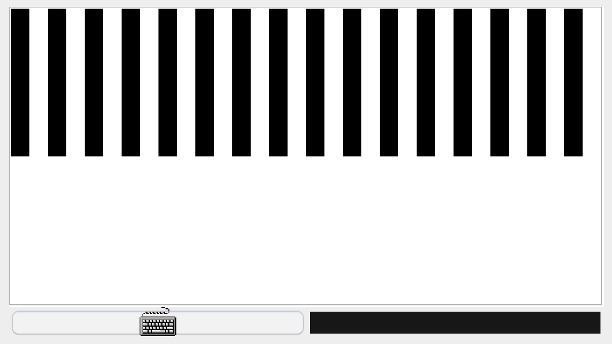
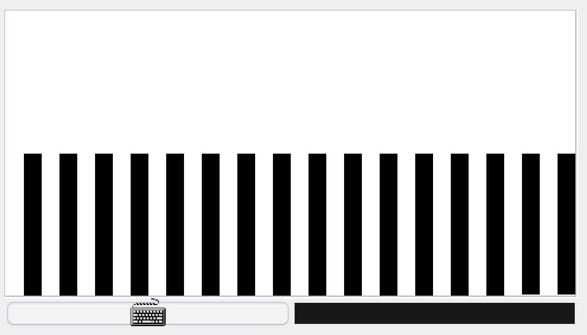
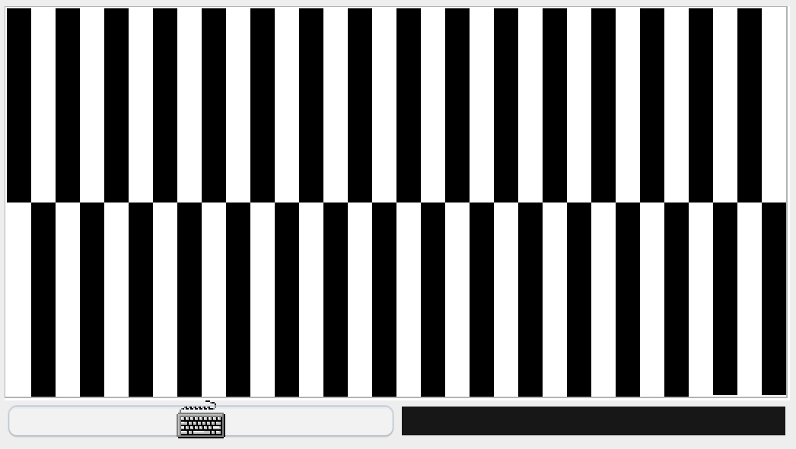

# Evaluación de la Unidad 1

## Problema: Programa en Assembler para el computador Hack de Nand2Tetris

## Descripción del Problema:

Los estudiantes deben crear un programa en ensamblador para el computador Hack de Nand2Tetris que implemente las siguientes funcionalidades:

1. **Bucle Infinito para Revisar el Teclado:**
   El programa debe comenzar con un bucle infinito que revise constantemente el teclado en busca de entrada del usuario. Cuando se presione una de las siguientes teclas: **U, D o C**, el programa debe saltar a una rutina específica para manejar la acción asociada a cada tecla.

2. **Funcionalidad de la Tecla U (*Up*):**
   Cuando se presiona la tecla U, el programa debe pintar la parte superior de la pantalla. Comenzando desde el inicio de la pantalla, se debe alternar entre pintar y no pintar cada registro (16 pixeles), saltando un registro entre cada registro pintado. Observe la figura 1 como referencia. 

    

        
    

    

        <strong>Figura 1:</strong> Comportamiento al presionar la tecla U.
    

3. **Funcionalidad de la Tecla D (*Down*):**
   Cuando se presiona la tecla **D**, el programa debe pintar la parte inferior de la pantalla. Los registros pintados de negro en la parte inferior de la pantalla no deben superponerse a los registros pintados de negro en la parte superior de la pantalla. Es decir, debe haber registros (*pixeles*) en blanco por encima de los registros (*pixeles*) pintados previamente. La figura 2 muestra el comportamiento del programa al presionar únicamente la tecla D. 

    

        
    

    

        <strong>Figura 2:</strong> Comportamiento al presionar la tecla D.
    

    En el caso de que se haya presionado previamente la tecla U, al presionar la tecla D, se observará una imagen como la de la figura 3. 

    

        
    

    

        <strong>Figura 3:</strong> Comportamiento al presionar las teclas U y D.
    

4. **Funcionalidad de la Tecla C (*Clear*):**
   Cuando se presiona la tecla **C**, el programa debe borrar toda la pantalla, es decir, restablecer todos los registros de la pantalla a 0. Observe la figura 4 como referencia.

    

        
    

    

        <strong>Figura 4:</strong> Comportamiento al presionar la tecla C.
    

## Restricciones:
- El programa debe estar escrito en ensamblador para el computador Hack de Nand2Tetris.
- Según el Código de Honor, el trabajo se debe presentar de forma individual, se debe reportar al profesor cualquier uso de herramientas de Inteligencia Artificial o ayuda externa.
- La copia entre estudiantes será causa de sanción.

## Código fuente:
Los estudiantes deben modificar el archivo de código fuente en ensamblador (**program.asm**) que se encuentra en la carpeta **problem** del repositorio. Incluya su nombre y ID en el encabezado del archivo.

## Documentación
Se debe agregar un archivo llamado **Documentacion.md**, donde el estudiante debe explicar qué hace cada parte del código. Se debe incluir un video demostrativo y expliativo. 

# Evaluación

La evaluación de esta unidad se llevará a cabo en dos partes. 
## Solución del problema
El **40%** de la calificación corresponderá a la creación y documentación del código en ensamblador. Los estudiantes deberán pasar con éxito los vectores de prueba configurados en GitHub, lo que demostrará la funcionalidad correcta del programa. Además, se espera que el repositorio de GitHub contenga documentación detallada sobre cómo funciona el código, incluyendo explicaciones claras de cada parte del mismo.

## Sustentación de la solución
El restante **60%** de la calificación se basará en la sustentación del trabajo. Los estudiantes deberán crear un **video** de aproximadamente **10 minutos** de duración, en el cual realizarán una demostración en tiempo real del funcionamiento del código. Durante la presentación, los estudiantes deberán explicar qué hace cada parte del programa, proporcionando una descripción detallada de la lógica implementada y los algoritmos utilizados. Se espera que los estudiantes demuestren un profundo entendimiento del código y su capacidad para comunicar eficazmente los conceptos técnicos involucrados.